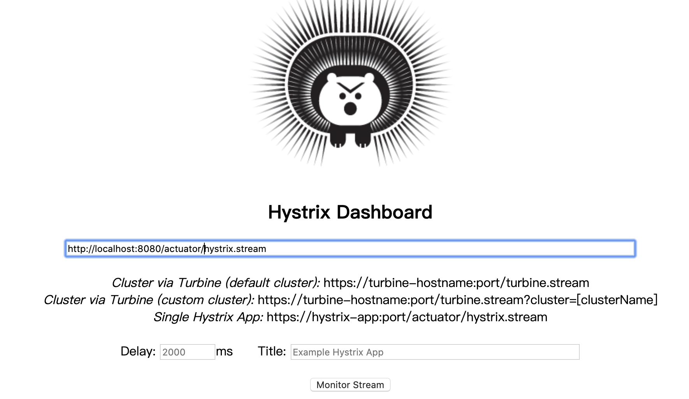
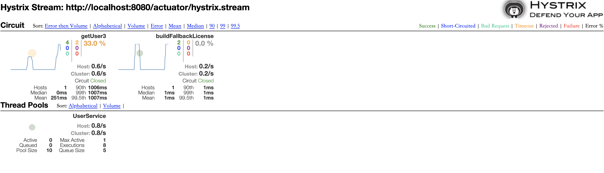

# 前言

### 版本说明

```
<parent>
  <groupId>org.springframework.boot</groupId>
  <artifactId>spring-boot-starter-parent</artifactId>
  <version>2.1.13.RELEASE</version>
  <relativePath/>
</parent>
<dependencyManagement>
  <dependencies>
    <dependency>
      <groupId>org.springframework.cloud</groupId>
      <artifactId>spring-cloud-dependencies</artifactId>
      <version>Greenwich.SR5</version>
      <type>pom</type>
      <scope>import</scope>
    </dependency>
  </dependencies>
</dependencyManagement>
<dependencies>
  <dependency>
    <groupId>org.springframework.cloud</groupId>
    <artifactId>spring-cloud-starter-netflix-hystrix</artifactId>
  </dependency>
</dependencies>
```

### 源代码

目前只对hystrix-core模块添加了注释：[源代码注释版](https://github.com/leviathanstan/Hystrix)

源代码解析：[Hystrix源码时序图](Hystrix源码时序图.md) 

# 开发指南

### 配置文件详解

下面示例的各项配置的值都是Hystrix的默认配置，所有Hystrix可以配置的选项都在这里了。只对部分配置进行了注释，其它没注释的配置如字面意思。

配置的优先级问题：Hystrix全局默认 < 配置文件里的default配置 < 注解里的配置 < 配置文件里指定commandKey的配置

```
hystrix:
 *# 默认配置见com.netflix.hystrix.HystrixCommandProperties*
 command:
  default:
   execution:
    isolation:
     strategy: THREAD
     thread:
      timeoutInMilliseconds: 1000
      interruptOnTimeout: true
      *#在使用queue方法返回的Future的cancel方法时是否对线程进行中断*
      *#网上甚至官方wiki上都是这个配置：interruptOnCancel: false，但1.5.x版的源码实际上是下面这个配置*
      interruptOnFutureCancel: false
     semaphore:
      maxConcurrentRequests: 10
    timeout:
     enabled: true
   fallback:
    enable: true
    isolation:
     semaphore:
      maxConcurrentRequests: 10 *#fallback方法最高并发数，对两种隔离方式都有效*
   circuitBreaker:
    enabled: true
    requestVolumeThreshold: 20
    sleepWindowInMilliseconds: 5000
    errorThresholdPercentage: 50
    forceOpen: false  *#会覆盖forceClose*
    forceClosed: false
   metrics:  *#统计信息的窗口配置*
    rollingStats:
     timeInMilliseconds: 10000
     *# 统计指标一个时间窗口中桶的数目，只有HealthCountsStream是指定桶的大小的，其它都是用这个指定桶数*
     numBuckets: 10
    *# 计算请求延迟百分位的窗口设置，dashboard用*
    rollingPercentile:
     enabled: true
     timeInMilliseconds: 60000
     numBuckets: 6
     bucketSize: 100
    *# 断路器失败率统计桶的大小(HealthCountsStream)*
    healthSnapshot:
     intervalInMilliseconds: 500
   requestCache:
    enabled: true
   requestLog:
    enabled: true
 *# 默认配置见com.netflix.hystrix.HystrixCollapserProperties*
 collapser:
  default:
   maxRequestsInBatch: Integer.MAX_VALUE
   timerDelayInMilliseconds: 10
   requestCache:
    enabled: true
 *# 默认配置见com.netflix.hystrix.HystrixThreadPoolProperties*
 threadpool:
  default:
   coreSize: 10
   maximumSize: 10
   maxQueueSize: -1
   *#BlockingQueue不支持动态修改大小，所以如果需要动态限制队列的大小可以设置这个选项*
   *#当maxQueueSize=-1时，这个就不管用了。当这个比maxQueueSize小，maximumSize也不管用了*
   queueSizeRejectionThreshold: 5
   keepAliveTimeMinutes: 1
   *# 为true，maximumSize才管用*
   allowMaximumSizeToDivergeFromCoreSize: false
   *#线程池统计指标窗口设置，好像只在dashboard里用*
   metrics:
    rollingStats:
     timeInMilliseconds: 10000
     numBuckets: 10
```

以上的配置是所有commandKey的配置，如果想要对某个commandKey实例、threadpool实例、collapser实例单独进行配置，只要将default修改为对应Key即可，如下：

```
hystrix:
 command:
  *# =====对单个commandKey单独配置=======*
  user: # commandKey
   execution:
    isolation:
     strategy: THREAD
```

### 熔断

##### 断路器算法流程

> 具体实现见：com.netflix.hystrixHystrixCircuitBreaker.HystrixCircuitBreakerImpl

1. Hystrix会对每一个被监测的服务接口（即每个被@HystrixCommand标注的方法）进行监控。

1. Hystrix使用一个滑动窗口（默认10s）来对服务调用的失败率进行统计

1. 一个滑动窗口内会分为几个桶，窗口会以桶为单位来进行滑动

1. 当窗口滑动到一个新的桶时，会对整个窗口内的服务调用失败率（超时、异常、线程池/信号量reject）进行计算

1. 1. 如果整个时间窗口内发生的服务调用次数不足最小调用次数（20次），那么不做处理

1. 1. 如果达到了最小调用次数，查看整体故障百分比，如果百分比未达阈值（默认50%），不做处理

1. 1. 如果超过阈值，将开启断路器

1. 在断路器开启后，新来的服务调用处理流程

1. 1. 先判断当前时间和断路器开启时间之间的间隔，是否达到一个失败窗口大小（默认5s），如果达到，将断路器置为半开启状态且当前服务调用通行。如果这个通行的调用返回成功，那么会将断路器关闭。如果这个也没有成功，将断路器从半开启重置为开启。

1. 1. 如果还没达到一个失败窗口的大小或断路器已经在半开启状态（即一个失败窗口只能有一个调用通过），服务调用失败

##### 超时机制

下面简单介绍一下Hystrix超时机制的大概实现，详细可看源码。

1. 通过lift()函数对目标Observable进行代理，在目标Observable开始前提交定时任务延迟执行

1. 使用一个全局的ScheduledThreadPoolExecutor，当一个服务调用开始时，创建一个task放到ScheduledThreadPoolExecutor里面执行，task的延迟执行时间即为服务的超时时间。如果task有机会执行，那么说明调用超时（调用如果成功，会将task取消）

1. 在线程隔离下，超时后会尝试interrupt线程池中还在跑的线程。而在信号量隔离下，无法进行中断，只能设置一个状态位，在等待线程返回后再抛异常。

##### 指标统计

指标的统计使用了大量的Rxjava函数来进行指标的收集和过滤。其中简单说下滑动窗口的实现：主要是使用了Rxjava里的window、flatmap函数。而window函数是异步的，即其实也会开一个线程去进行指标统计，时间窗口中桶分得越多，单个桶的时间长度就越短，所需cpu资源就越多。

### fallback

可以为服务调用指定fallback方法，当服务调用失败、超时，走服务降级流程。

##### 使用注意

1. 如果要获取引发降级的异常，需在fallback方法参数列表中最后加上一个Throwable，不然Hystrix会吞异常

1. Error级别的异常不会走fallback，直接抛

1. fallback方法有最大并发数限制（可配置）

##### 执行线程（线程隔离下）

1. 超时引发fallback：fallback方法由ScheduledThreadPoolExecutor中的线程执行，ScheduledThreadPoolExecutor的线程数为cpu核心数，所以不要在fallback中执行运行时间长的代码。如果实在需要可以在fallback方法中再加上@HystrixCommand。 

1. 如果是抛异常引发的fallback，由抛异常的那条线程执行（即Hystrix线程池里的） 

1. 断路器开启或线程池reject，由原始请求那条线程执行 

##### Api

```
@HystrixCommand(fallbackMethod = "buildFallback")
public String getUser() {
  //...
}
public String buildFallback(Throwable throwable) {
  //...
}
```

### 隔离方式

##### 线程隔离

在线程隔离下，可以使用线程池机制将不同的资源使用不同的线程池隔离开。默认情况下，所有被@HystrixCommand标注的服务调用使用同一个线程池。

**线程池隔离优势：**

1. 可以对不同的资源进行隔离，且隔离度非常高。

1. 可对慢调用进行自动降级，当一个线程无法及时响应时，可以给予中断，防止级联阻塞（假如存在A->B->C调用链，B->C为慢调用，如果不能及时中断，会导致A->B也变成慢调用）

1. 利用线程池的特性，也使得线程隔离下，Hystrix拥有一定的流量控制能力。

**线程池隔离劣势：**

1. 使用线程池隔离会带来大量的线程，尤其是很多的线程池存在或线程池参数不恰当，过多的线程带来过多的上下文切换

**如何降低损耗：**

1. 若应用对相应时间敏感或本来应用的访问时间就很短（如访问缓存），可以使用信号量隔离的方式。

1. 若可以接受一定时间的请求延时，可以使用请求合并的方式，代价是需要为请求合并的api分配额外的代码开发。

1. 根据机器的实际情况或根据实际压测得出的性能数据来确定Hystrix各线程池的参数。

##### 信号量隔离

信号量隔离下，使用的是AtomicInteger来实现对一个资源的并发数控制。优点在于以相当小的资源损耗实现了不错的隔离效果。缺点是隔离度不够，无法中断慢调用，所以可能会导致慢调用扩散。

### 缓存

##### 说明

Hystrix的缓存机制，个人感觉用处不大。因为缓存的生命周期即一个请求的生命周期，可以这样理解：在一个controller调用里，如果多次调用了相同的service方法（方法相同，cachekey相同），那么就可以使用缓存。controller返回，那么缓存就没了。

##### Api

使用缓存需要在过滤器或拦截器中初始化HystrixRequestContext

```
@Component
public class HystrixFilter implements Filter {
  @Override
  @SuppressWarnings("unused")
  public void doFilter(ServletRequest servletRequest, ServletResponse servletResponse, FilterChain filterChain)
      throws IOException, ServletException {
    try(HystrixRequestContext context = HystrixRequestContext.*initializeContext*()){
      filterChain.doFilter(servletRequest, servletResponse);
    }
  }
}
```

标注一个方法是使用缓存的

```
@CacheResult
@HystrixCommand
public String getCache(@CacheKey int id) {
  //...
}
```

### 请求合并

##### 说明

使用请求合并有几点限制：

1. 请求合并是将多个请求合并到一个请求执行，因此要使用请求合并需要提供另外一个服务调用接口（使用批量参数来进行服务调用），调用方和被调用方都要提供。

1. 单个服务调用返回的结果参数为Future

1. 单一个服务调用被合并后，需要等待合并请求的发起（默认是10ms发起一次），合并请求里的所有请求的结果是一起返回的。可以理解为一个合并请求里的所有Future.get()是几乎同时返回。

1. 默认的请求合并作用域为REQUEST，即一个请求里的多个服务调用才可以合并。如果需要可以修改为全局作用域（Hystrix只在contrib模块提供了相关设置（即只能在注解里配置） ）

简单原理介绍：

1. 使用一个map来保存所有单个请求

1. 使用ScheduledThreadPoolExecutor来执行一个定时task（默认10ms），task的逻辑为从map中取请求，将其合并执行

1. 合并请求返回后，将response分发到单个请求上

##### Api

```
@HystrixCollapser(batchMethod = "getBatch")
public Future<String> getSingle(Integer id) {
  //...
}
@HystrixCommand
public List<String> getBatch(List<Integer> ids) {
  //...
}
```

### ThreadLocal传播

在线程隔离下，当需要将原始线程的ThreadLocal变量传递到Hystrix线程池里的线程时（实际发起服务调用的线程）。代码就不贴了，还挺多的。

### HystrixObservableCommand 

//todo

# Dashboard

### 单体应用

##### 准备工作

```
<dependency>
  <groupId>org.springframework.boot</groupId>
  <artifactId>spring-boot-starter-actuator</artifactId>
</dependency>
<dependency>
  <groupId>org.springframework.cloud</groupId>
  <artifactId>spring-cloud-netflix-hystrix-dashboard</artifactId>
</dependency>
*# actuator开放Hystrix的健康检查访问*
management:
 endpoints:
  web:
   exposure:
    include: hystrix.stream
```

为启动类加上@EnableHystrixDashboard注解

##### 使用

url：http://host:port/hystrix





说明：

- 实心圆颜色表示健康程度，大小表示流量大小 

- 曲线记录2分钟内流量的变化 

- 各项指标表示了一段时间内（推测是断路器的一个时间窗口（默认10s））内的各项指标 

- Bad Request代表抛出了@DefaultProperties或@HystrixCommand注解里ignoreExceptions配置的异常的请求数（这个指标不算入断路器的错误率里） 

- 其它指标如字面意思

- 原理就是：Hystrix把它统计的各项指标通过*actuator发送出去，dashboard所做的工作只不过是将各项指标分析后以图形的形式表现出来*

### 集群监控

使用Turbine和consul注册中心来聚合集群各个节点的指标数据，如果用于生产环境，还需进行相应权限控制的扩展。

pom.xml

```
<dependency>
  <groupId>org.springframework.cloud</groupId>
  <artifactId>spring-cloud-starter-netflix-turbine</artifactId>
  <exclusions>
    <exclusion>
      <groupId>org.springframework.cloud</groupId>
      <artifactId>spring-cloud-starter-netflix-eureka-client</artifactId>
    </exclusion>
  </exclusions>
</dependency>
```

application.yml

```
turbine:
 appConfig: feign *#consul里的服务名*
 aggregator:
  clusterConfig: default
 clusterNameExpression: "'default'"
```

启动类上加上注解

```
@EnableHystrixDashboard
@EnableTurbine
```

# 框架适配

### Feign

appliaction.yml

```
feign:
 hystrix:
    enabled: true#默认为关闭状态
```

pom.xml

```
<dependency>
  <groupId>org.springframework.cloud</groupId>
  <artifactId>spring-cloud-starter-openfeign</artifactId>
</dependency>
<!-- 服务注册相关 -->
<dependency>
  <groupId>org.springframework.cloud</groupId>
  <artifactId>spring-cloud-starter-consul-discovery</artifactId>
</dependency>
<dependency>
  <groupId>org.springframework.boot</groupId>
  <artifactId>spring-boot-starter-actuator</artifactId>
</dependency>
```

使用api

```
@FeignClient(name = "aid", path = "/v1", fallbackFactory = FallbackHandle.class)
public interface AidClient {
  @GetMapping(value = "/get")
  String get();
}
@Component
public class FallbackHandle implements FallbackFactory<AidClient> {
  @Override
  public AidClient create(Throwable throwable) {
    return new AidClient() {
      @Override
      public String get() {
        return "error !!!!";
      }
    };
  }
}
```

和原生Hystrix不同的是

1. fallback方法需要专门的类来提供；

1. @FeignClient注解不提供其它Hystrix配置，如需配置，要在applicaiton.yml配置文件里写，格式和原生的Hystrix一致。

1. 需要注意和ribbon之间的集成关系

### Gateway

pom.xml

```
<dependencies>
  <dependency>
    <groupId>org.springframework.cloud</groupId>
    <artifactId>spring-cloud-starter-gateway</artifactId>
  </dependency>
  <dependency>
    <groupId>org.springframework.cloud</groupId>
    <artifactId>spring-cloud-starter-netflix-hystrix</artifactId>
  </dependency>
  <dependency>
    <groupId>org.springframework.cloud</groupId>
    <artifactId>spring-cloud-starter-consul-discovery</artifactId>
  </dependency>
</dependencies>
```

application.yml

```
spring:
 cloud:
  gateway:
   routes:
    - id: aid
     uri: lb://aid
     predicates:
      - Path=/aid/**
     filters:
      *#- name: Hystrix*
      *#  args:*
      *#   name: aidCmd*
      *#   fallbackUri: forward:/fallback*
   default-filters:
    - name: Hystrix
     args:
      name: cmd#name即为HystrixCommand的commondKey，可根据key对Hystrix进行配置
      fallbackUri: forward:/fallback#fallback方法url
```

Hystrix的过滤器实现在*org.springframework.cloud.gateway.filter.factory.HystrixGatewayFilterFactory*

如果需要也可以参照它的实现，自己实现一个自定义的过滤器

### Webflux

pom.xml

```
<dependency>
  <groupId>org.springframework.boot</groupId>
  <artifactId>spring-boot-starter-webflux</artifactId>
</dependency>
<dependency>
  <groupId>org.springframework.cloud</groupId>
  <artifactId>spring-cloud-starter-netflix-hystrix</artifactId>
</dependency>
```

Api

```
@GetMapping("/single")
public Mono<String> apiNormalSingle() {
  //org.springframework.cloud.netflix.hystrix.HystrixCommands
  return HystrixCommands.*from*(fooService.emitSingle())
      .fallback(Mono.*just*("error----"))
      .commandName("single")
      .toMono();
}
//service
public Mono<String> emitSingle() {
  return Mono.*just*(ThreadLocalRandom.*current*().nextInt(0, 2000))
      //引发fallback
      .delayElement(Duration.*ofMillis*(2000))
      .map(e -> e + "d");
}
```

只是将MVC里的AOP实现，改为Reactor的方式实现，配置的方式和原生的一样。

# 动态配置

这里使用netflix的archaius来做个简单的动态配置demo

pom.xml

```
<dependency>
  <groupId>org.springframework.cloud</groupId>
  <artifactId>spring-cloud-starter-netflix-hystrix</artifactId>
</dependency>
```

定时从配置中心拉取配置，使用archaius提供的api

```
@Component
public class DynamicSource implements PolledConfigurationSource{
  @Override
  public PollResult poll(boolean initial, Object checkPoint) {
    Map<String, Object> complete = new HashMap<>(8);
    //从配置中心拉取配置，这里简单使用map做个例子
    complete.put("hystrix.command.default.execution.isolation.thread.
timeoutInMilliseconds", "3000");
    return PollResult.*createFull*(complete);
  }
}
@Configuration
public class DynamicConfig {
  @Bean
  public DynamicConfiguration dynamicConfiguration(DynamicSource source) {
    DynamicConfiguration configuration = new DynamicConfiguration(
        source, new FixedDelayPollingScheduler(
            //初始化延迟
            30 * 1000,
            //拉取间隔
            5000,
            false)
    );
    ConfigurationManager.*install*(configuration);
    return configuration;
  }
}
```

archaius是对apache common configuration类库的扩展，也可以直接手动调用api设置相应的属性

```
ConfigurationManager.*getConfigInstance*().setProperty("hystrix.command. default.execution.isolation.thread.timeoutInMilliseconds", 3000);
```