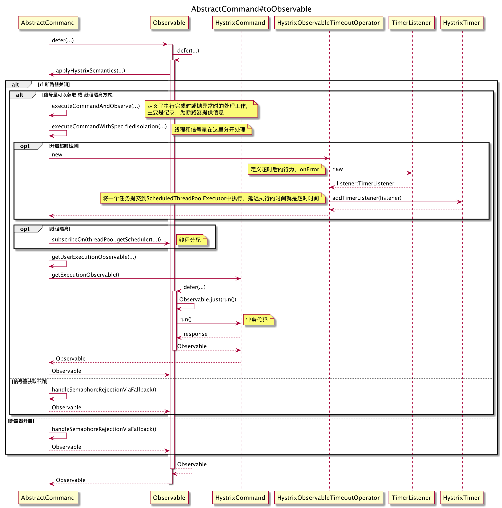
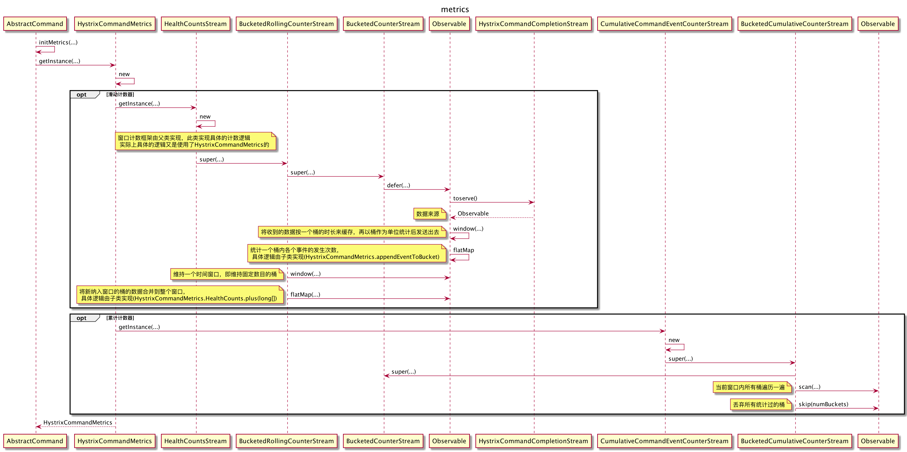
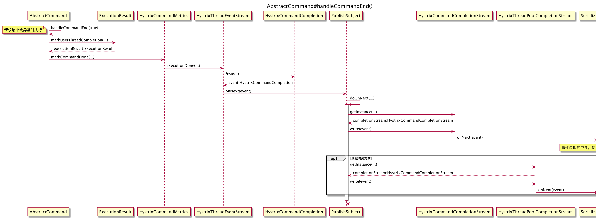
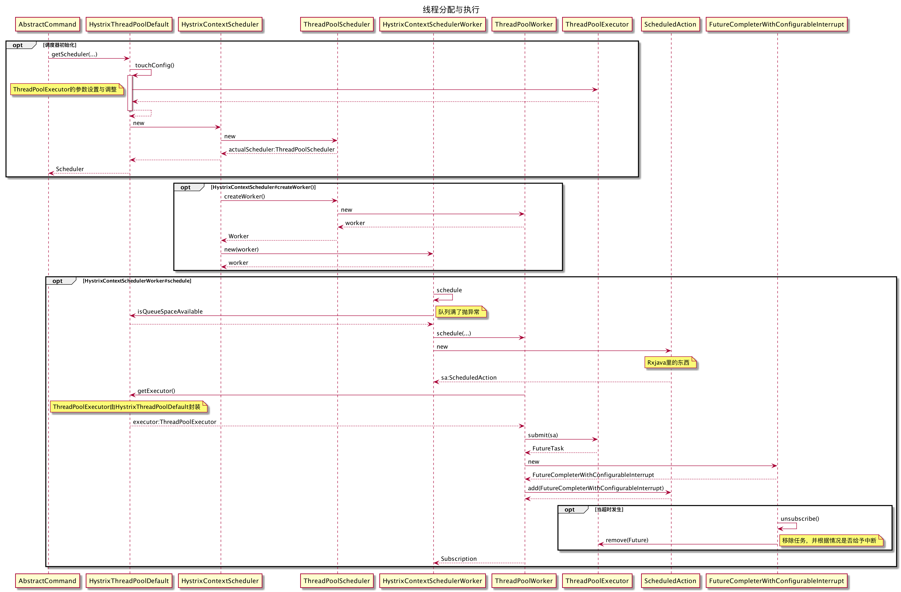
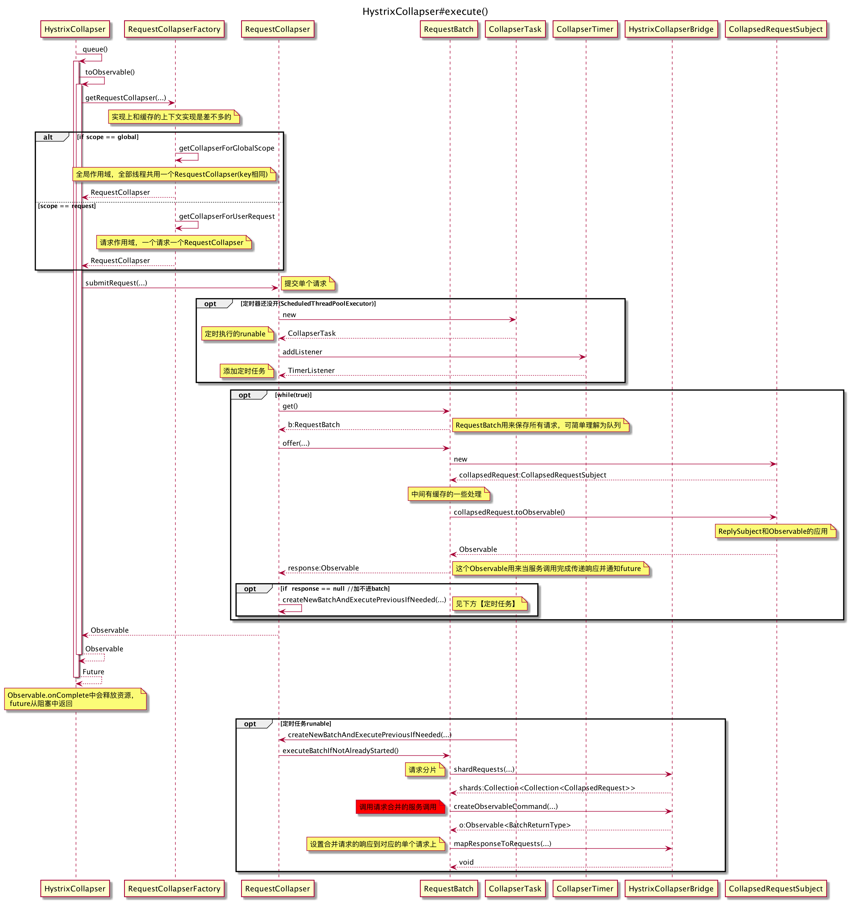
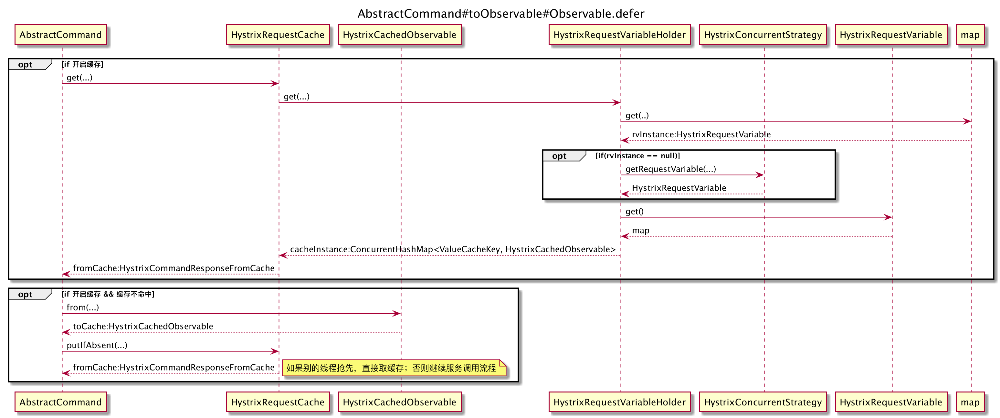

# 前言

鉴于网上已有不少分析源码的文章，我也是看着那些文章理解的，所以此处不再重复劳动，只贴上一些自己画的代码执行时序图（如图片模糊请放大），可以结合[注释版源码](https://github.com/leviathanstan/Hystrix)或网上博客理解。

另外，由于本人对Rxjava理解不够，一些异步操作的图可能表达的有偏差。

### Hystrix执行入口

Hystrix的大体执行流程。

### 指标统计逻辑

使用了Rxjava提供的window函数来进行滑动窗口计数，使用flatmap来对窗口的数据进行统计

### 请求结束后的善后工作

主要是对一些指标进行统计，并发送相应的事件，Rxjava应用较多。

### 线程分配与执行逻辑

对Rxjava里的Scheduler做了扩展，实际上使用的是jdk里提供的线程池

### 请求合并实现逻辑

简单来说，就是将需要进行请求合并的单个请求全部放到一个集合里，同时开启一个定时任务，定时从集合里取请求合并后执行

### 缓存实现

感觉缓存的实现挺绕的，随便画了下。

