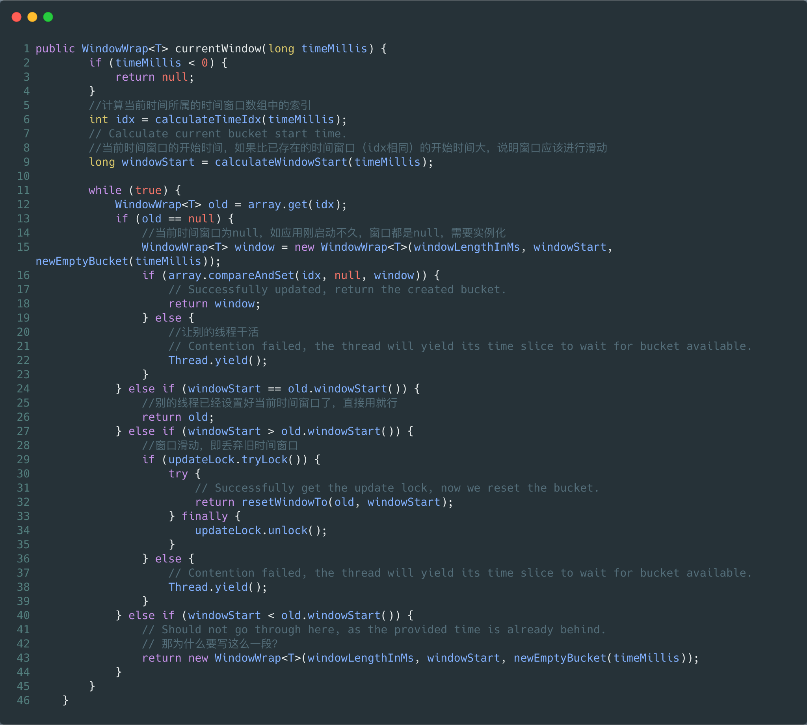
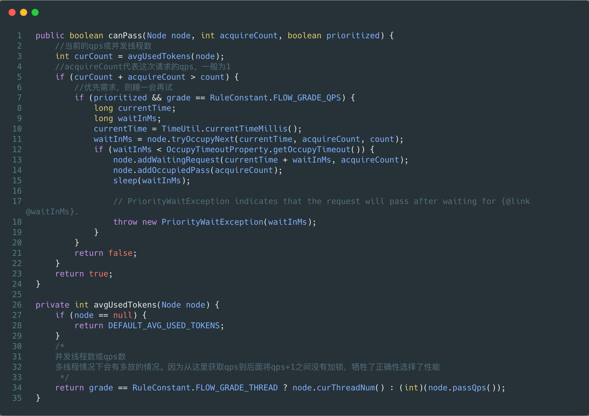

# 版本

1.7.2

# 初始化

## 测试用例

```
public void foo() {
  try (Entry entry = SphU.*entry*(*resourceName*)){
    System.*out*.println("Hello Sentinel");
  } catch (BlockException bockException) {
    bockException.printStackTrace();
  }
}
```

## 相关时序图


## 源码跟踪

### CtSph.entryWithPriority

从SphU.*entry作为入口，略过几个重载的entry方法，最终来到CtSph.entryWithPriority*


其中较为重要的有13、21、34行，以下分别来跟踪下。

#### 1 InternalContextUtil.*internalEnter*


最终调用了ContextUtil.trueEnter

##### 1.1 ContextUtil.trueEnter


在ContextUtil中使用了一个静态的HashMap来保存所有资源对应的Node；需要注意的是：一个资源对应一个EntranceNode，每个线程都会对这个唯一的EntranceNode进行封装，然后加上当前请求的来源（sentinel有根据来源来进行流控的功能），保存到ThreadLocal中。

#### 2 *CtSph.*lookProcessChain


和ContextUtil中的实现类似，把所需的对象放入map中，chain的创建操作在DefaultSlotChainBuilder中实现

##### 2.1 DefaultSlotChainBuilder.build


首先创建了一个DefaultProcessorSlotChain，从循环体中的addLast操作，可以猜测到chain链大概是链表的形式，其中DefaultProcessorSlotChain作为头节点。接下来看看其它slot是如何创建的。

###### 2.1.1 SpiLoader.loadPrototypeInstanceListSorted


从ServiceLoaderUtil类名可以猜到，使用的是jdk的ServiceLoader来进行slot的加载，即spi的方式。事实上的确如此，可以在源码中发现有如下文件

META-INF/services/com.alibaba.csp.sentinel.slotchain.ProcessorSlot


一共看到有8个slot被默认创建：

- NodeSelectorSlot，负责收集资源的路径，并将这些资源的调用路径，以树状结构存储起来，用于根据调用路径来限流降级；

- ClusterBuilderSlot，则用于存储资源的统计信息以及调用者信息，例如该资源的 RT, QPS, thread count 等等，这些信息将用作为多维度限流，降级的依据；

- StatistcSlot，则用于记录，统计不同纬度的 runtime 信息；

- FlowSlot，则用于根据预设的限流规则，以及前面 slot 统计的状态，来进行限流；

- AuthorizationSlot，则根据黑白名单，来做黑白名单控制；

- DegradeSlot，则通过统计信息，以及预设的规则，来做熔断降级；

- SystemSlot，则通过系统的状态，例如 load1 等，来控制总的入口流量；

- LogSlot，日志相关

如果进入以上slot的代码，可以看到类上有@Spi的注解，其中带有order的属性，而在loadPrototypeInstanceListSorted中会对创建后的slot根据order值进行排序，所以，chain链中的slot顺序是固定的。

slot是以spi的方式加载的，说明我们可以自己实现自定义的slot，通过spi可以动态地对sentinel进行扩展。

#### 3 chain.entry

在上面跟踪DefaultSlotChainBuilder.build时，我们知道，chain的头的实例是DefaultProcessorSlotChain，且后面接着各个以spi方式加载的slot，接下来我们看看它们是如何被调用的。


可以看到，DefaultProcessorSlotChain的entry方法最终调用了父类AbstractLinkedProcessorSlot的fireEntry方法，而在父类又保存着一个next的成员变量。看到next，一些都明了了，chain就是一个链表的结构，一个节点代表着一个功能，如流控、熔断等。

到此，sentinel的初始化追踪到此结束。（有关异步调用的处理没有进行说明）

# 滑动窗口计数

## 前言

前面分析了sentinel一共默认有8个slot默认被加载，现在我们对其中的StatisticSlot来进行源码追踪，来看看sentinel中的qps和并发线程数是如何记录的。

## 相关时序图


## 源码跟踪

### StatisticSlot.entry


先来看下qps计数的实现

#### 1 DefaultNode.addPassRequest


DefaultNode继承于StatisticNode，而clusterNode本身就是个StatisticNode，所以接下来只跟踪下super.addPassRequest(count)这行代码。

其中clusterNode的作用是：//todo

##### 1.1 StatisticNode. addPassRequest


rollingCounterInSecond和rollingCounterInMinute都是ArrayMetric实例，只不过它们的统计维度不同，其中rollingCounterInSecond是以1s为一个大窗口，分为2个小窗口；rollingCounterInMinute是以1min为一个大窗口，分为60个小窗口。接下来只分析下rollingCounterInSecond的实现。

###### 1.1.1 ArrayMetric.addPass


其中data的实际类型是OccupiableBucketLeapArray，继承于LeapArray，其中currentWindow方法实现在LeapArray里。

逻辑实际上很简单，可以认为data是所有窗口的集合，我们根据当前时间从data中取得当前时间所属的窗口的包装类(WindowWrap)，实际窗口实现类为MetricBucket，窗口实际上是对LongAdder数组的封装，LongAdder数组中每一个元素都对应着一个事件，值就是这个窗口内事件发生的次数。

实际上实现和Hystrix的滑动窗口计数很类似。

###### 1.1.1.1 LeapArray



关键的地方都加上了注释，具体流程如下：

1. LeapArray是一个窗口的集合，窗口集合是以数组的形式保存的，所以首先需要计算当前时间应该归于哪个桶里。

1. 计算得到当前时间在一个桶里的开始时间。用于判断是否需要进行滑动

1. While

1. 1. 当前时间没有对应的窗口，创建一个即可。如应用刚启动时

1. 1. 当前时间窗口的开始时间和已经存在的窗口的开始时间相同，那么直接使用这个窗口就可以

1. 1. 当前时间窗口的开始时间比已经存在的窗口的开始时间要晚，说明当前时间已经和旧窗口间隔了一段较长的距离，旧的窗口应该被淘汰了，创建一个新窗口来替代它。

逻辑和实现实际上很简单，和Hystrix的实现相比，Hystrix使用了Rxjava提供的windows和skip函数来达到相同的功能，代码也很简洁和易懂（熟悉Rxjava为前提），孰优孰劣还不太好判断。

#### 2 DefaultNode.increaseThreadNum


同样的，调用了父类StatisticNode的increaseThreadNum方法

##### 2.1 StatisticNode.increaseThreadNum


其中curThreadNum是一个LongAdder，就是如此简单。

# 流控

## 前言

流控实现于FlowSlot

## 相关时序图


## 源码跟踪

### Flow.entry


首先调用checkFlow进行流量控制，如果需要进行限流，直接抛出FlowException。并在通过流量控制之后调用fireEntry进入调用链的下一个节点进行相应处理。

#### 1 FlowRuleChecker.checkFlow


首先先取得当前资源所有的FlowRule，然后在遍历每个规则调用canPassCheck方法进行判断。其中要注意的是ruleProvider是一个Function类型，由FlowSlot传入，让我们看一下是什么：

##### 1.1 ruleProvider.apply


用过sentinel硬编码功能的同学可能认识FlowRuleManager，硬编码就是将rule注入到FlowRuleManager里，所以其实所有的FlowRule其实都保存在FlowRuleManager里，硬编码的实现以及如何生效的这些我们也懂了。

##### 1.2 canPassCheck


在这里出现了分叉点，我们看到了sentinel集群流控的实现入口。首先看下集群流控实现

###### 1.2.1 passClusterCheck


要注意的是，无论是TokenServer还是TokenClient，其代码都会执行到这里，通过相同的接口不同的实现来实现了代码的可复用。

由于TokenClient具体实现涉及到了较多的封装还有一些netty使用，所以此处不打算继续说明下去，下面只说一下TokenServer是如何进行集群限流的。

###### 1.2.1.1 ClusterFlowChecker.*acquireClusterToken*


流程：

1. 首先判断整个集群的qps是否已到达上限，如果是则直接限流

1. *通过calcGlobalThreshold方法获得集群的限流阈值*

1. 计算得到当前qps和阈值之间的距离

1. 1. 如果没超过阈值，通过

1. 1. 超过阈值

1. 1. 1. 有优先级配置，返回等待信号

1. 1. 1. 需要限流

让我们来看下*calcGlobalThreshold方法的实现：可见有两种策略*


当策略为GLOBAL时，集群的QPS阈值是不会改变的。

当策略为AVG_LOCAL时，集群的QPS阈值为所有存活节点的阈值之和。

###### 1.2.2 passLocalCheck


第一步先获取Node节点，在“滑动窗口计数”里面我们知道Node节点的作用为保存当前资源的统计信息，Node接口的具体实现类有DefaultNode、ClusterNode，而它们又都继承于StatisticNode，在StatisticNode实现了qps计数和并发线程数的统计，即selectedNode是作为一个辅助类来为限流提供数据来源。在下一节我们会看到，sentinel的根据来源限流、调用关系限流等功能实现在selectNodeByRequesterAndStrategy方法里。

下一步，FlowRule.getRater方法返回的是TrafficShapingController抽象类，反向查找可以看到其实现类有4个，分别对应上限流的4种效果。后面会对这四种controller分别进行介绍。

###### 1.2.2.1 selectNodeByRequesterAndStrategy


在这两个方法中，实现了基于调用关系进行限流的逻辑。

### DefaultController.canPass



默认是直接拒绝的限流策略，当qps或并发线程数超过阈值，直接返回false

### RateLimiterController.canPass


匀速排队的实现，参考漏桶算法实现，思路是：系统每隔一段时间会放出一个令牌，只有一个线程可以获得这个令牌执行请求。

具体实现上，使用了一个全局变量来保存最新一个请求通过的时间（即最后一个令牌的下发时间），costTime为令牌下发的间隔，expectedTime为可以获取令牌的时间。

1. 如果可以获取令牌的时间小于当前时间，说明当前请求可以获取令牌，请求通过

1. 如果现在还不能够获取令牌，且现在到可以获取令牌的时间距离还很长，请求拒绝

1. 虽然现在还不能获取令牌，但待会很快就可以，先睡一会再起来拿

注意：全程没有使用锁，说明期间会出现并发问题，but it's okay.

### WarmUpController.canPass


参考的是令牌桶算法。其中，令牌入桶是不断进行的，如果令牌消耗的速度大于令牌入桶的速度，说明按这个趋势系统会处于一个”热“的状态；当令牌消耗的速度小于令牌入桶的速度，系统最终会处于一个”冷“的状态，令牌会逐渐堆积，到达warningToken。

当处于“冷”状态时，需要在配置的阈值基础上减去一定的数值，以防突发流量把系统压垮。

#### 1 syncToken


需要说明的是，令牌入桶只需要以一个慢的速度进行就行，所以当出现并发时，说明令牌入桶的速度太快了，可以忽略并发问题。

##### 1.1 coolDownTokens


这里再次为令牌的添加加上了阻扰，只有系统处于热状态时，才尝试添加令牌。

第二个if条件，个人不是很理解作者用意。

### WarmUpRateLimiterController.canPass


实现上是基于“冷启动”+“匀速排队”，当系统处于“冷”状态时，处理一个请求的速度会比“热”状态下的速度要慢，所以请求的排队时间需要适当的延长一点。