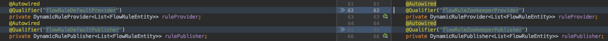
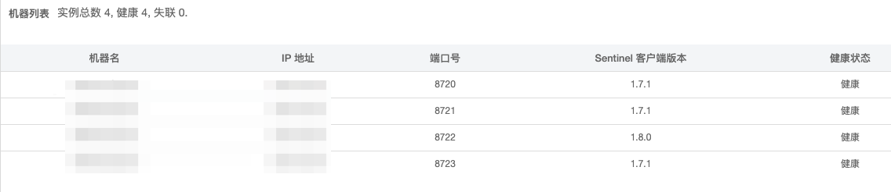
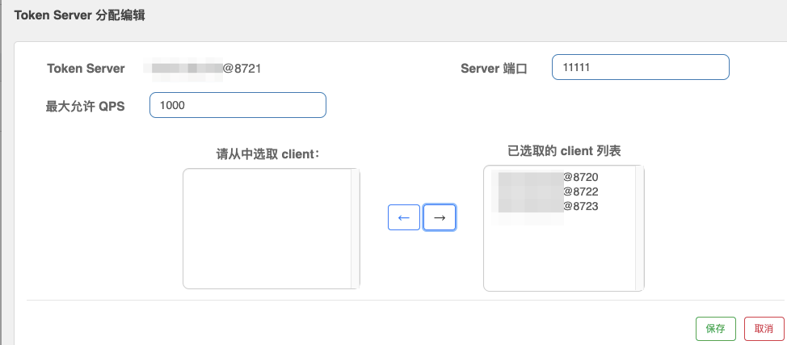
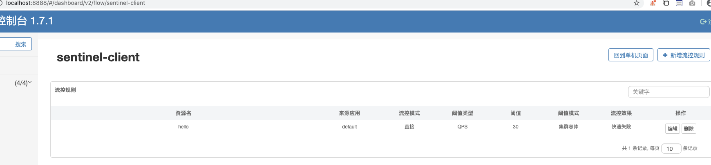
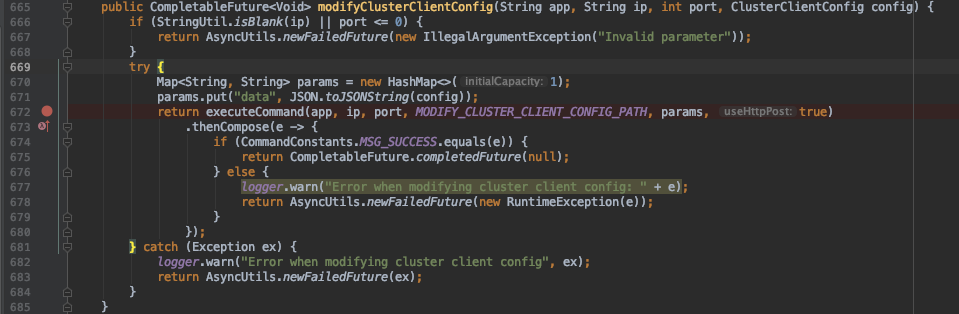
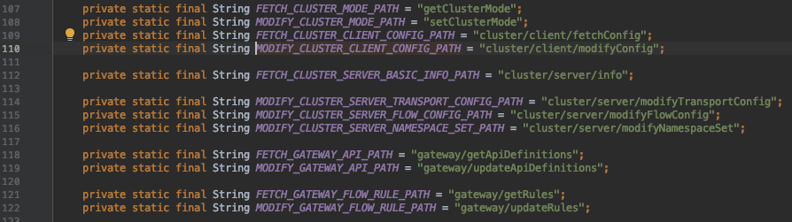
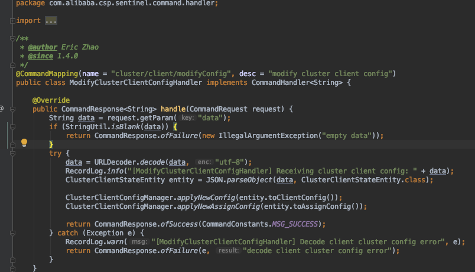
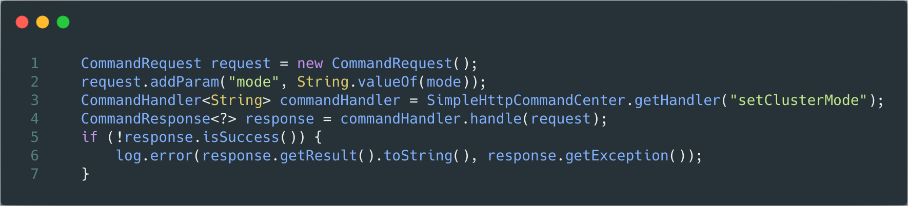
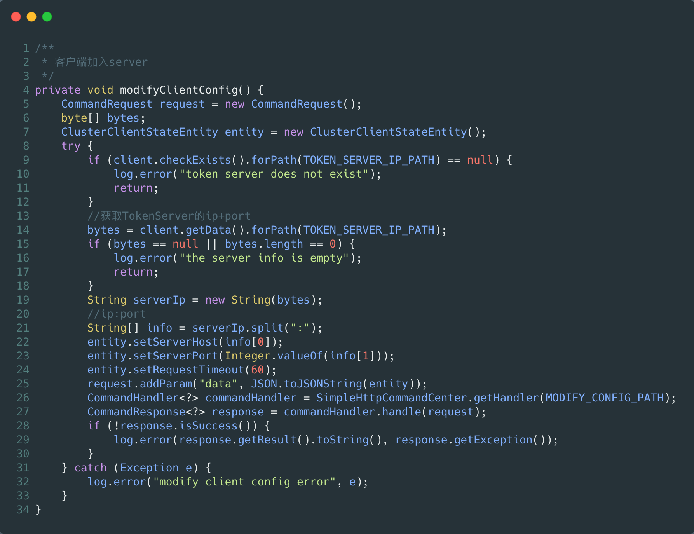
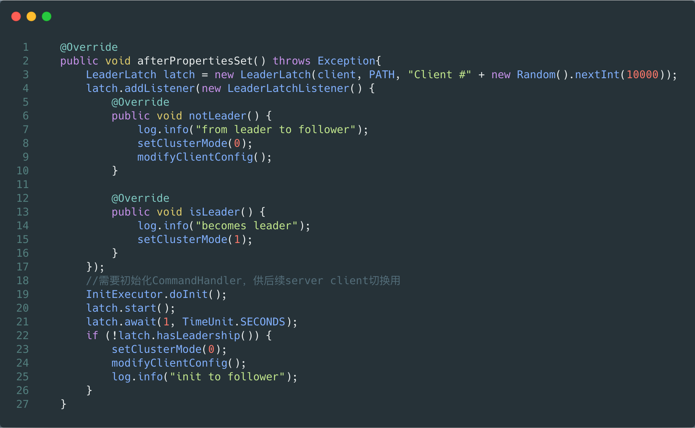

# 前言

sentinel提供集群限流、集群热点参数限流功能，不过要实际使用，还需要自己进行一点改造，以下做一个实践记录。

- 本文参考[官方文档](https://github.com/alibaba/Sentinel/wiki/Sentinel-集群限流-入门指南)实现

- 实践源码已上传[github](https://github.com/leviathanstan/flow.git)

# 简单集群

注：这里使用一个独立的Token Server节点作为server端。

### 依赖

Token client

spring-cloud-starter-alibaba-sentinel整合了很多依赖，嫌麻烦可以使用这个包，或者可以像下面server端那样一个个地引用。

```
<dependency>
  <groupId>com.alibaba.cloud</groupId>
  <artifactId>spring-cloud-starter-alibaba-sentinel</artifactId>
  <version>2.1.2.RELEASE</version>
</dependency>
<dependency>
  <groupId>com.alibaba.csp</groupId>
  <artifactId>sentinel-datasource-zookeeper</artifactId>
  <version>1.7.1</version>
</dependency>
```

Token server

```
<dependency>
  <groupId>com.alibaba.csp</groupId>
  <artifactId>sentinel-core</artifactId>
  <version>1.7.1</version>
</dependency>
<dependency>
  <groupId>com.alibaba.csp</groupId>
  <artifactId>sentinel-transport-simple-http</artifactId>
  <version>1.7.1</version>
</dependency>
<dependency>
  <groupId>com.alibaba.csp</groupId>
  <artifactId>sentinel-cluster-server-default</artifactId>
  <version>1.7.1</version>
</dependency>
<dependency>
  <groupId>com.alibaba.csp</groupId>
  <artifactId>sentinel-datasource-zookeeper</artifactId>
  <version>1.7.1</version>
</dependency>
```

### 配置动态规则源

这里使用zookeeper搭建配置中心，使用docker来部署一个3节点的zookeeper集群。

可参考[dockerhub](https://hub.docker.com/_/zookeeper)实践，推荐以docker-compose的方式

### 客户端改造

新建一个InitFunc类，用于注册zookeeper数据源。这个类需要使用spi的方式加载。

```
public class InitZookeeperSource implements InitFunc {
  private String remoteAddress = "";
  private String group = "/sentinel/dynamic/";
  private String data = "sentinel-client";
  @Override
  public void init() {
    initFlow();
  }
  private void initFlow() {
    ReadableDataSource<String, List<FlowRule>> flowRuleDataSource = new ZookeeperDataSource<>(remoteAddress, group + data,
        source -> JSON.*parseObject*(source, new TypeReference<List<FlowRule>>() {}));
    FlowRuleManager.*register2Property*(flowRuleDataSource.getProperty());
  }
}
```

### 服务端改造

和客户端类似，注册数据源。

```
public class ZookeeperSource implements InitFunc {
  private String remoteAddress = "";
  private String group = "/sentinel/dynamic/";
  private String data = "sentinel-client";
  @Override
  public void init() {
    ClusterFlowRuleManager.*setPropertySupplier*(namespace -> {
      return new ZookeeperDataSource<>(remoteAddress, group + data,
          source -> JSON.*parseObject*(source, new TypeReference<List<FlowRule>>() {})
      ).getProperty();
    });
  }
}
```

### 控制台改造

直接使用官方github提供的[demo](https://github.com/alibaba/Sentinel/tree/master/sentinel-dashboard/src/test/java/com/alibaba/csp/sentinel/dashboard/rule/zookeeper)，将其中的四个类复制到自己的控制台下即可。

然后需要FlowControllerV2类中将两个提供服务的bean替换为我们刚才复制过去的。



### 使用

##### 启动

启动多个客户端，一个服务端。其中无论是客户端还是服务端都需要连上控制台。如果引入了spring-cloud-starter-alibaba-sentinel依赖可以使用yml来进行配置，如果不是可以使用jvm参数指定，服务端和客户端的project.name都是相同的。

注意：需要启动后需要对客户端发送一个请求后，客户端才会开始sentinel的初始化，连接控制台。

##### 配置server和client

这里我启动三个client节点，一个server节点来进行测试，在“机器列表”可以看到所有节点都成功连接。



在“集群流控“中将client端加入server端进行管理



##### 配置流控规则

要注意的是，控制台中集群流控的配置的访问路径为[localhost:8888/#/dashboard/v2/flow/{appname}](http://localhost:8888/#/dashboard/v2/flow/{appname})，单机的流控页面路径为[localhost:8888/#/dashboard/flow/{appname}](http://localhost:8888/#/dashboard/flow/{appname})，我没有在页面找到相应的入口，只能以路径访问。



至此，所有需要的改造都已完成，本人已做过相关测试，it can work.

# 自动选举

### 前言

Token Server使用嵌入的方式和Token client在同一台机器上。每个Token client同时也是Token server，通过zookeeper来进行自动选举，每次选择一个leader来进行对整个集群的限流协调。

此外，我们不仅要自动选举，还要server/token自动切换，常规的方式需要在控制台进行操作才能指定server端，但这个操作也要去掉，参照dashboard来实现。

[源码](https://github.com/leviathanstan/flow/tree/master/sentinel-cluster/sentinel-dual)已上传，主要是选择了LeaderLatch进行自动选举。

### 主要依赖

```
<dependency>
  <groupId>com.alibaba.cloud</groupId>
  <artifactId>spring-cloud-starter-alibaba-sentinel</artifactId>
</dependency>
<dependency>
  <groupId>com.alibaba.csp</groupId>
  <artifactId>sentinel-datasource-zookeeper</artifactId>
  <!-- 兼容spring-boot-starter-web -->
  <exclusions>
    <exclusion>
      <groupId>org.slf4j</groupId>
      <artifactId>slf4j-api</artifactId>
    </exclusion>
    <exclusion>
      <groupId>org.slf4j</groupId>
      <artifactId>slf4j-log4j12</artifactId>
    </exclusion>
  </exclusions>
  <version>1.7.1</version>
</dependency>
```

### server/client自主切换

在sentinel-dashboard中肯定实现了相关server/client的切换api，让我们debug去看看。



最终可以debug到这个方法，如果继续看下去，会发现dashboard是使用了http的方式给client发送了一个请求，请求发送的是server端的信息，url信息在上图的*MODIFY_CLUSTER_CLIENT_CONFIG_PATH*



以上便是dashboard对client和server进行指派时用到的api，我们的关注点在于cluster/client/modifyConfig，全局搜索后会发现在实现在command模块。



自此，我们可以自行构造http请求在server/client切换时发送出去，以替代dashboard的手动指派。

继续研究下去的话，会发现sentinel提供了相应的api来进行相应的command进行调用，省了自行构造http请求的麻烦，再继续看下去的话会发现sentinel也是基于apache的http工具包进行了封装。好像sentinel还提供了netty的调用api，有空再研究。

自行构造api通知client/server端进行状态切换，关键代码如下：



client不仅仅只做状态切换，还要获取到server的信息，以加入server旗下的集群，代码如下：



### 简单选举



自此，一个简单的自动选举sentinel集群完成。

# TODO

- 控制台持久化